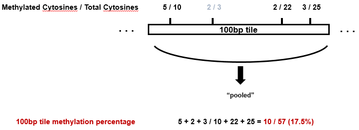
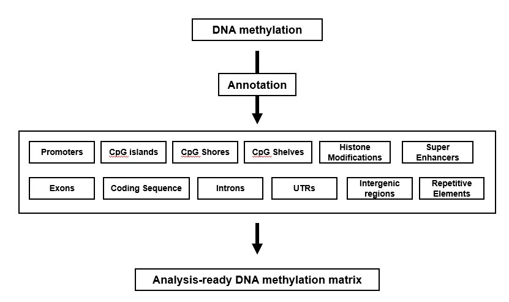

# Project LUAD

---
## 0.Sample descrption
50 Lung adenocarcinoma samples and their 50 adjacent normal samples

---
## 1.Epigenome - DNA methylation Analysis

We usee the SureSelectXT Methyl-Seq Library Preparation kit which targets ~4 million CpGs in the genome (hg19-based). 

### 1-1. Preprocessing Sequencing Reads
We ran Trimmomatic verision 0.33 to trim low quality bases and adapter contaminated reads.
```
java -jar trimmomatic-0.33.jar PE -phred33 read1.fastq read2.fastq read1_paired.fastq read1_unpaired.fastq read2_paired.fastq read2_unpaired.fastq ILLUMINACLIP:TruSeq2-PE.fa:2:30:10 LEADING:3 TRAILING:3 SLIDINGWINDOW:4:15 MINLEN:30
```
### 1-2. Read Alignment, deduplication, extraction of DNA methylation, statistical testing (DMR identification) and annotation
We performed read alignment onto hg19 reference genome, deduplication and DNA methylation calculation via using Bismark version 0.14.3
```
<Alignment>
bismark --bowtie2 -1 read1_paired.fastq -2 read2_paired.fastq
<Deduplication>
deduplicate_bismark sample.bam 
<Methylation Extraction>
bismark_methylation_extractor -p --mbias_off --no_overlap --counts --bedGraph --no_header --cytosine_report sample.bam
```
We integrated Watson and Crick Strand CpG methylation Coverage from sample_deduplicated.CpG_report.txt

Then, by merging each sample methylation Coverage file into merged one (LUAD_methyl_all_Strand_integrated.txt), we generated M x N matrix where, M and N represents CpG sites in the hg19 genome and the number of samples (100, 50 normal 50 tumor) respectively.



##### Figure 1. Caluclating DNA Methylation Percentage of 100bp tile


Filtering off-target tiles, paired t-test and Benjamini-Hochberg correction of p value, Differentially methylated region (DMR) identification.

Annotation of DNA methylation tiles


##### Figure 2. Annotation of DNA methylation matrix

### 1-3. Analysis
#### 1-3.1 

#### 1-3.2

#### 1-3.3 Transcription Factor binding site 

## 2.Transcriptome - RNA-seq Analysis

### 2-1. Preprocessing Sequencing Reads


## 3. Exome - Exome-seq Analysis

### 3-1. Preprocessing Sequencing Reads

## 4. Data Integration

```
hello hello this is a test fuckfuck
```
